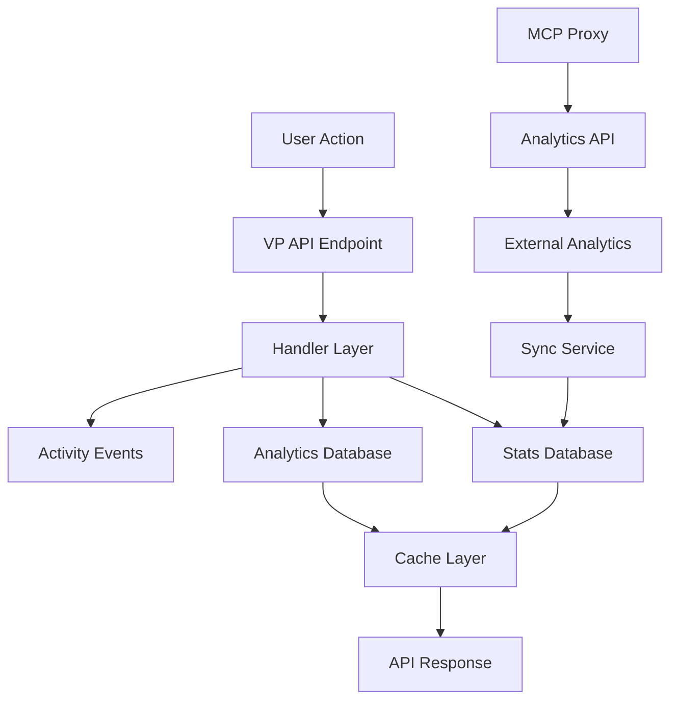

# PluggedIn Registry Stats & Analytics System Guide

## System Overview

The PluggedIn Registry Stats & Analytics system is a comprehensive solution for tracking MCP server usage, performance, and user engagement. It consists of multiple integrated components working together to provide real-time and historical analytics.

## Architecture Components

### 1. Data Collection Layer

#### MongoDB Collections
- **`servers_v2`**: Core server registry data
- **`stats`**: Server statistics (installs, ratings, views)
- **`feedback`**: User feedback and ratings with comments
- **`activity_events`**: All user activity events
- **`search_analytics`**: Search queries and conversion tracking
- **`api_calls`**: API endpoint usage metrics
- **`analytics_metrics`**: Global registry metrics
- **`time_series_data`**: Historical data for trends
- **`milestones`**: Achievement tracking

#### External Analytics Integration
- **Elasticsearch**: Stores detailed usage events from MCP proxy
- **Analytics API**: Provides enriched metrics (active users, usage patterns)
- **Sync Service**: Periodically syncs external analytics with MongoDB

### 2. API Layer

#### VP (v-plugged) Endpoints
Base URL: `https://registry.plugged.in/vp`

**Stats Endpoints:**
- `GET /vp/servers` - List servers with stats
- `GET /vp/servers/{id}/stats` - Individual server statistics
- `POST /vp/servers/{id}/install` - Track installation
- `POST /vp/servers/{id}/rate` - Submit rating/feedback
- `GET /vp/servers/{id}/feedback` - Get server feedback

**Analytics Endpoints:**
- `GET /vp/analytics/dashboard` - Dashboard metrics with trends
- `GET /vp/analytics/growth` - Growth metrics by period
- `GET /vp/analytics/activity` - Real-time activity feed
- `GET /vp/analytics/hot` - Trending/hot servers
- `GET /vp/analytics/search` - Search analytics
- `GET /vp/analytics/time-series` - Historical data

**Global Stats:**
- `GET /vp/stats/global` - Overall registry statistics
- `GET /vp/stats/leaderboard` - Top servers by metric
- `GET /vp/stats/trending` - Currently trending servers

### 3. Data Flow



## How Data Gets Populated

### 1. Installation Tracking
When a user installs a server:

```javascript
POST /vp/servers/{server_id}/install
{
  "platform": "vscode",
  "version": "1.2.3",
  "source": "marketplace"
}
```

**What happens:**
1. `TrackInstallHandler` receives the request
2. Validates the server ID and source
3. Calls `IncrementInstallCount()` to update stats
4. Records an install event in `activity_events`
5. Updates global metrics
6. Invalidates relevant caches

### 2. Rating/Feedback Submission
When a user rates a server:

```javascript
POST /vp/servers/{server_id}/rate
Authorization: Bearer {github_token}
{
  "rating": 5,
  "comment": "Excellent tool!"
}
```

**What happens:**
1. `SubmitFeedbackHandler` validates authentication
2. Creates feedback entry in `feedback` collection
3. Updates aggregate rating in `stats` collection
4. Records rating event in `activity_events`
5. Triggers rating recalculation
6. Clears feedback and stats caches

### 3. Search Tracking
Search events are tracked to understand user behavior:

**What happens:**
1. Search query recorded with timestamp
2. Results count stored
3. Conversion tracked if search leads to install
4. Analytics updated for search success rate

### 4. API Call Tracking
Every API call is tracked for performance monitoring:

**What happens:**
1. Middleware captures request details
2. Response time measured
3. Error status recorded
4. Metrics aggregated by endpoint

### 5. External Analytics Sync
If configured, external analytics are synced periodically:

**What happens:**
1. Sync service runs every 15 minutes
2. Fetches metrics from Analytics API
3. Updates `active_installs`, `daily_active_users`
4. Preserves local install counts
5. Calculates growth rates

## Frontend Integration

### Key Integration Points

1. **Installation Tracking**
   ```javascript
   // Track when user installs
   await fetch(`/vp/servers/${serverId}/install`, {
     method: 'POST',
     headers: { 'Content-Type': 'application/json' },
     body: JSON.stringify({ platform: 'web' })
   });
   ```

2. **Display Stats**
   ```javascript
   // Get server stats
   const stats = await fetch(`/vp/servers/${serverId}/stats`);
   // Returns: install_count, average_rating, rating_count, etc.
   ```

3. **Dashboard Metrics**
   ```javascript
   // Get enhanced dashboard
   const metrics = await fetch('/vp/analytics/dashboard?period=week');
   // Returns: trends, comparisons, hot servers, etc.
   ```

4. **Activity Feed**
   ```javascript
   // Real-time activity
   const activity = await fetch('/vp/analytics/activity?limit=20');
   // Returns: recent installs, ratings, searches
   ```

### Caching Strategy

- **Server-side**: 5-minute TTL for most endpoints
- **Client-side**: Implement local caching
- **Conditional requests**: Use ETags when available
- **Rate limiting**: 100 req/min (public), 500 req/min (authenticated)

### Best Practices

1. **Batch requests** when loading multiple stats
2. **Handle errors** gracefully with fallbacks
3. **Show loading states** during data fetches
4. **Implement retry logic** with exponential backoff
5. **Cache aggressively** on the client side
6. **Use WebSocket/SSE** for real-time features (future)

## Data Consistency

### Source-based Tracking
- **REGISTRY**: Official registry servers
- **COMMUNITY**: Community-contributed servers
- Each source maintains separate statistics
- Aggregated views available with `?aggregated=true`

### Event Ordering
- All events timestamped in UTC
- Activity feed ordered by timestamp
- Stats updates are eventually consistent
- Cache invalidation on writes

### Data Retention
- Activity events: 90 days
- Time series data: 1 year
- Feedback: Permanent
- API call logs: 30 days

## Security Considerations

1. **Authentication**
   - Public read for most endpoints
   - GitHub OAuth for writes (feedback, claims)
   - Rate limiting by IP/token

2. **Input Validation**
   - All inputs sanitized
   - SQL/NoSQL injection prevention
   - Parameterized queries only

3. **Privacy**
   - User IDs anonymized
   - No PII in activity logs
   - GDPR-compliant data handling

## Monitoring & Debugging

### Health Checks
- `/vp/analytics/dashboard` - Overall system health
- Response headers indicate service status
- Error rates tracked per endpoint

### Common Issues

1. **Stats showing 0**
   - Check if sync service is running
   - Verify MongoDB connection
   - Check cache invalidation

2. **Missing analytics data**
   - Ensure Analytics API is configured
   - Check sync service logs
   - Verify server IDs match

3. **Slow responses**
   - Check MongoDB indexes
   - Review cache hit rates
   - Monitor query performance

### Debug Endpoints
- Add `?debug=true` for detailed responses (dev only)
- Check logs for sync failures
- Monitor cache effectiveness

## Implementation Checklist

### Backend Setup
- [ ] MongoDB collections created with indexes
- [ ] VP endpoints registered in router
- [ ] Analytics database initialized
- [ ] Sync service configured (optional)
- [ ] Cache service running
- [ ] CORS configured for frontend domain

### Frontend Integration
- [ ] Stats API client implemented
- [ ] Installation tracking added
- [ ] Dashboard components created
- [ ] Error handling implemented
- [ ] Caching strategy defined
- [ ] Loading states added

### Testing
- [ ] Unit tests for handlers
- [ ] Integration tests for API
- [ ] Frontend component tests
- [ ] End-to-end user flows
- [ ] Performance benchmarks
- [ ] Error scenario coverage

## Roadmap

### Current Features
- ✅ Basic stats tracking
- ✅ Enhanced analytics dashboard
- ✅ Feedback system
- ✅ Activity feeds
- ✅ Search analytics
- ✅ Growth metrics

### Planned Features
- 🔄 Real-time updates via WebSocket
- 🔄 Advanced filtering and segmentation
- 🔄 Custom analytics dashboards
- 🔄 Export functionality
- 🔄 Predictive analytics
- 🔄 A/B testing framework

## Troubleshooting Guide

### Problem: Analytics endpoints return 404

**Solution:**
1. Ensure analytics database initialized successfully
2. Check logs for initialization errors
3. Verify VP routes are registered
4. Rebuild and restart the service

### Problem: Stats not updating

**Solution:**
1. Check if writes are reaching MongoDB
2. Verify cache invalidation is working
3. Check for validation errors in logs
4. Ensure correct source parameter

### Problem: High latency on analytics endpoints

**Solution:**
1. Check MongoDB query performance
2. Verify indexes are created
3. Increase cache TTL
4. Consider pagination for large datasets

### Problem: Data mismatch between sources

**Solution:**
1. Verify sync service is running
2. Check timestamp alignment
3. Review aggregation logic
4. Ensure consistent server IDs

## Contact & Support

- **GitHub Issues**: Report bugs and feature requests
- **Documentation**: This guide and API references
- **Logs**: Check application logs for detailed errors
- **Monitoring**: Use dashboard metrics for health status